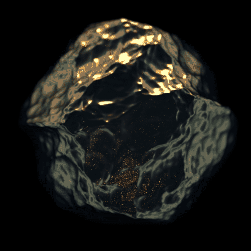

<h1>Urvi Umesh</h1>

<h3>AI Engineer who turns ambitious ideas into real-time systems.</h3>

I build at the intersection of <b>AI, computer vision, multimodal systems, and agentic AI</b>.
I enjoy taking ideas that sound ambitious on paper and pushing them all the way toward
working systems that can perceive, reason, respond, and operate in real time.

Currently pursuing a <b>B.E. in Information Science and Engineering</b> at
<b>MS Ramaiah Institute of Technology, Bangalore</b>.

 

<h2>About Me</h2>

I am an AI engineer focused on <b>building systems, not just models</b>.
My work spans real-time computer vision, multimodal AI, agentic workflows, healthcare AI,
AR, and applied research.

What interests me most is the engineering between the model and the real world:
<b>latency, orchestration, reliability, inference pipelines, APIs, edge processing,
evaluation, and human interaction</b>.

I like problems where the first prototype is only the beginning. Whether it is analysing
multiple video streams, turning a natural-language request into a sequence of AI tools,
or building an adaptive rehabilitation system, I care about making the final system
actually usable.

<h2>Recognition</h2>

<table>
<tr>
<td><b>Google Solution Challenge 2026</b></td>
<td>National Semi-Finalist · selected from 38,300+ registrants</td>
</tr>
<tr>
<td><b>Smart India Hackathon 2025</b></td>
<td>National Finalist · Top 5 teams from 50,000+ registrations</td>
</tr>
<tr>
<td><b>Inceptrix Hackathon</b></td>
<td>National Winner · 200+ competing teams</td>
</tr>
<tr>
<td><b>Advaya Hackathon</b></td>
<td>National Winner · 100+ competing teams</td>
</tr>
<tr>
<td><b>HaccVerse Hackathon</b></td>
<td>National Winner · 100+ competing teams</td>
</tr>
<tr>
<td><b>Unisys Innovation Program 2025</b></td>
<td>National Semi-Finalist · selected from 12,760+ registrants</td>
</tr>
</table>

 

<h2>Selected Work</h2>

<h3>01 · Agentic Surveillance Intelligence Platform</h3>

A real-time AI surveillance platform designed around advanced video intelligence,
combining detection, recognition, tracking, interaction analysis, and agentic orchestration.

<ul>
<li>Built an occlusion-resistant facial recognition pipeline for persistent identity tracking across multiple video streams.</li>
<li>Integrated YOLO-based detection, InsightFace recognition, ByteTrack tracking and NetworkX interaction analysis.</li>
<li>Developed a local LLM agent that converts natural-language requests into executable surveillance workflows.</li>
<li>Designed the system to transform raw video into structured intelligence, movement paths, association graphs and investigation reports.</li>
</ul>

<b>Stack:</b> Python · YOLOv8 · InsightFace · OpenCV · TensorFlow · NetworkX · ByteTrack · Local LLM

<h3>02 · Multimodal AI Mock-Interview Evaluation</h3>

Built an AI platform that evaluates interview behaviour across multiple modalities,
including posture, facial expressions, eye contact and speech confidence.

<ul>
<li>Generated behavioural assessment reports in under <b>8 seconds</b> per session.</li>
<li>Reduced facial landmark inference and Flask API latency by <b>40%</b>.</li>
<li>Enabled concurrent processing of <b>3 interview streams</b> with under <b>300 ms</b> response time.</li>
</ul>

<b>Stack:</b> Python · OpenCV · MediaPipe · TensorFlow · Flask

<h3>03 · Ethical Clinical Decision Support System</h3>

Built a clinical decision-support system that evaluates whether treatment recommendations
remain appropriate under patient-specific and ethical constraints.

<ul>
<li>Evaluated <b>10,000+ synthetic patient scenarios</b> across 15+ clinical and ethical constraints.</li>
<li>Achieved <b>92% accuracy</b>, <b>0.91 F1-score</b> and <b>93% recall</b> on the evaluation set.</li>
<li>Designed the system around explainable constraint-aware decision support rather than simple classification.</li>
</ul>

<b>Stack:</b> TensorFlow · Keras · Scikit-learn · Flask · Python

<h3>04 · AI + AR Physiotherapy Rehabilitation</h3>

A mobile rehabilitation platform designed to make guided physiotherapy more accessible
through real-time movement analysis, AR feedback and adaptive exercise progression.

<ul>
<li>Used OpenCV pose estimation across <b>20+ rehabilitation exercises</b>.</li>
<li>Integrated Unity AR overlays for real-time visual feedback.</li>
<li>Built adaptive exercise recommendations based on patient performance history.</li>
<li>Added progress tracking, milestones and adaptive goals to encourage rehabilitation adherence.</li>
</ul>

<b>Stack:</b> Unity · ARCore · OpenCV · Python

<h2>Experience</h2>

<h3>AI Intern · Sttarkel</h3>

Built multimodal AI systems for behavioural analysis and optimised the inference and API
pipeline for real-time concurrent processing.

<h3>Founding Core Member · AWS Cloud Club, MSRIT</h3>

Co-founded Karnataka's first AWS Student Cloud Club, organised hands-on cloud workshops,
ideathons and hackathon onboarding sessions, and helped grow active membership to
<b>80+ students</b>.

<h2>Tech Stack</h2>

<b>AI / ML:</b> TensorFlow · Scikit-learn · OpenCV · MediaPipe · Hugging Face Transformers · LangChain · NumPy · Pandas
 
<b>Engineering:</b> Python · Java · C · JavaScript · Flask · React Native · Docker · Git
 
<b>Cloud:</b> AWS · Azure · Azure DevOps · Firebase · Jenkins · GitHub Actions · Linux

<h2>Research</h2>

<h3>Quantum Steganography with QOTP-LSQ</h3>

Co-authored research proposing a quantum steganography framework combining
<b>Quantum One-Time Pad encryption</b>, quantum image representations and LSQ embedding
to securely hide encrypted audio payloads within video data.

<b>Research paper:</b> Under Review · May 2026

<h2>Engineering Focus</h2>

<table>
<tr>
<td width="50%">

<b>Real-Time AI</b> 
Low-latency inference, concurrent streams, video pipelines and deployment.

</td>
<td width="50%">

<b>Computer Vision</b> 
Detection, recognition, tracking, segmentation and multimodal perception.

</td>
</tr>
<tr>
<td>

<b>Agentic Systems</b> 
Natural-language planning, tool calling, orchestration and AI workflows.

</td>
<td>

<b>Applied AI</b> 
Healthcare, security, accessibility and human-centred intelligent systems.

</td>
</tr>
</table>

<h2>GitHub Activity</h2>

